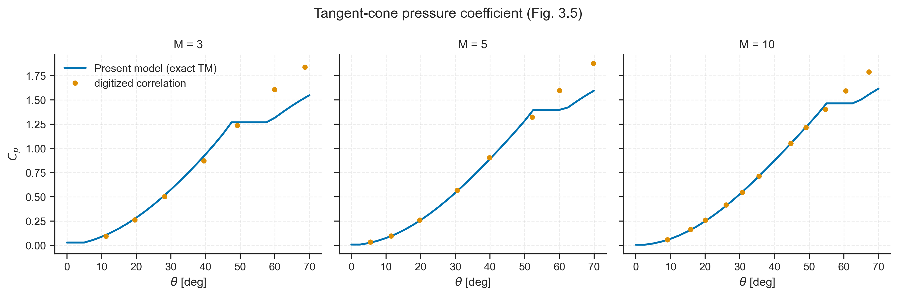
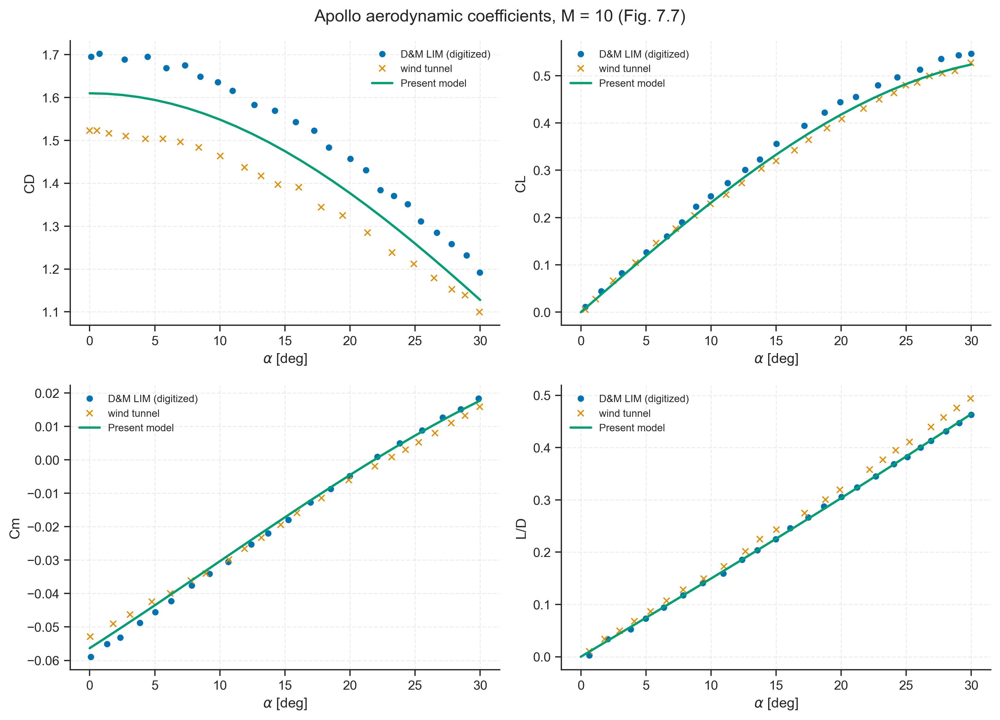
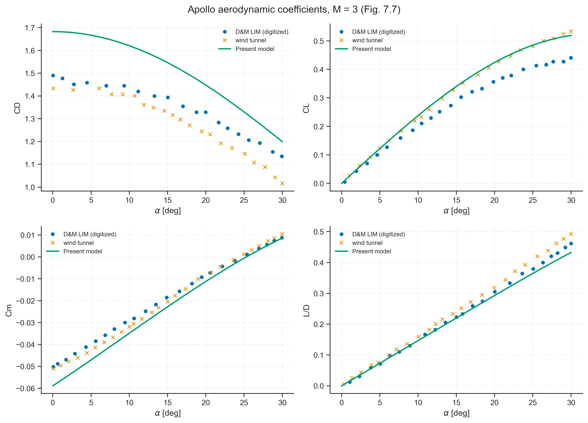
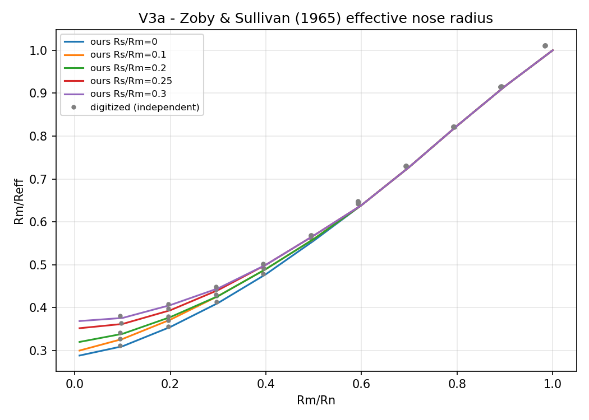
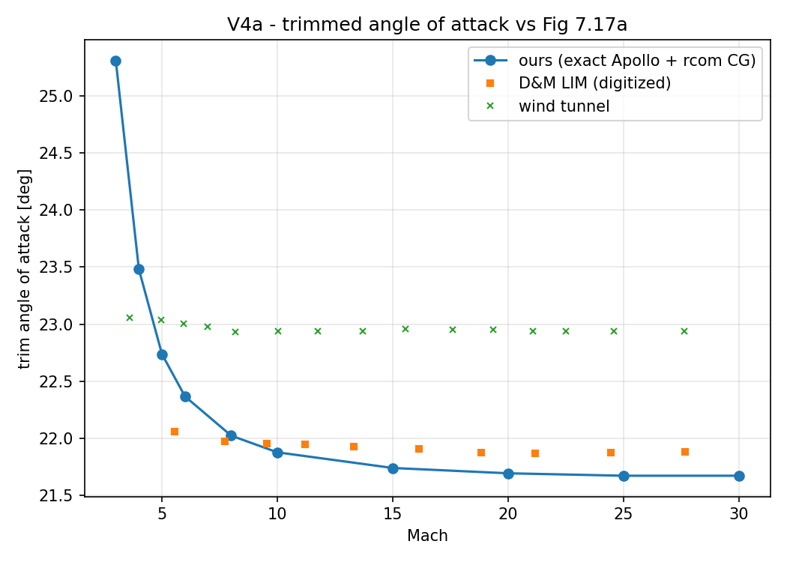
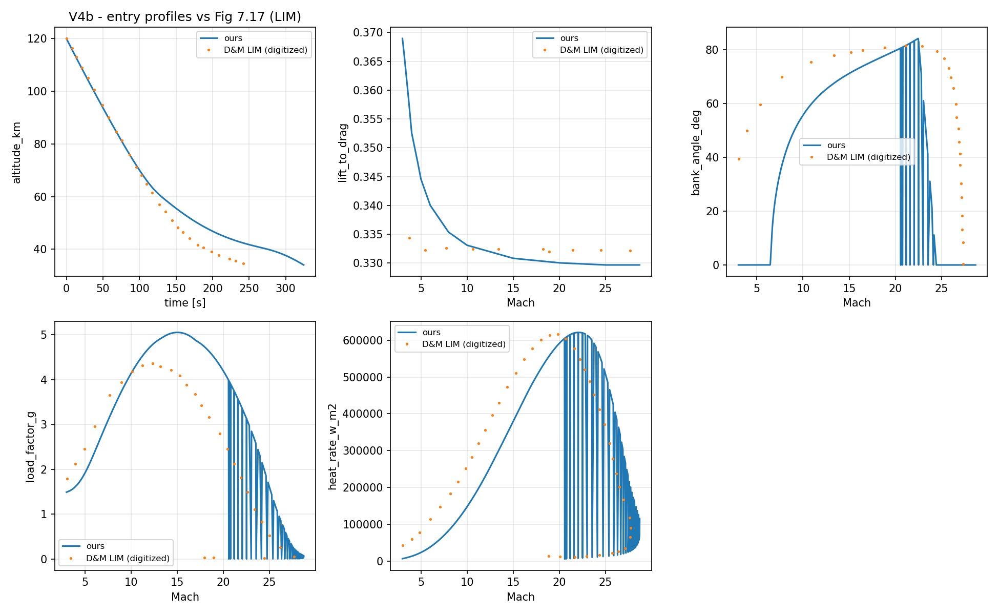

# capsule_opt

Hypersonic capsule shape optimization: a Local-Inclination-Method (LIM) aerothermodynamic
model coupled to 3-DoF entry-trajectory simulation and multi-objective optimization,
validated against Dirkx & Mooij, *Aerothermodynamic Design and Assessment of Space
Vehicles* (2017). Developed from a defended MSc thesis.

## Progress overview

| Stage | Scope | Status |
|---|---|---|
| Thesis (defended Jul 2026) | Modified-Newtonian aero + Sutton–Graves heating + NSGA-II shape optimization of an Apollo-class capsule | ✅ complete |
| Model upgrade | D&M-faithful LIM aerodynamics (modified Newtonian nose, exact Taylor–Maccoll tangent-cone afterbody, Prandtl–Meyer lee, Mach-blended databases), Chapman shoulder heating, US76 + extension, rate-limited no-skip bank guidance | ✅ complete |
| Validation V0–V4 | 20+ checks against PlotDigitizer-extracted book data on the exact Apollo entry case (V = 7.83 km/s, γ = −4°, m = 4532 kg) | ✅ complete — all model-level checks pass; trajectory-level gaps attributed with evidence (below) |

## Package layout

```
capsule_opt/
  geometry/         # axisymmetric capsule profile + shape parameterization
  properties.py     # panel discretization, part tagging (nose / afterbody), mass properties
  aerodynamics/     # LIM pressure laws: modified Newtonian, exact Taylor-Maccoll
                    #   tangent-cone (cached table), Prandtl-Meyer; Mach-blended databases
  heating/          # Sutton-Graves stagnation + Chapman/Smithsonian shoulder heating
  atmosphere/       # US76 up to 86 km + hypersonic extension to 120 km
  trajectory/       # 3-DoF rotating-Earth entry EOM, RK4, no-skip bank guidance (rate-limited)
  trim/             # trim angle-of-attack solver
  optimization/     # objectives, constraints, metrics (heat load, load factor, ground track)
main.py             # NSGA-II shape-optimization entry point (pymoo)
validation/         # V0-V4 validation suite vs Dirkx & Mooij (2017) — see below
data/cache/         # cached Taylor-Maccoll cone Cp table (CSV)
results/            # generated figures + run logs
```

## Validation results (Phase 1, closed September 2026)

| Check | Content | Verdict |
|---|---|---|
| V0 | US76 + extension vs reference tables | PASS (anchors ~2e-5) |
| V1 | Local pressure laws vs book charts (Newtonian, tangent-cone, Prandtl-Meyer, Mach blend) | PASS |
| V2 | **Apollo CD/CL/Cm/L/D vs book Fig 7.7 (M=3, M=10)** — the core check | **9/9 PASS** (L/D within 0.022 absolute) |
| V3 | Heating: Zoby–Sullivan stagnation, shoulder-ratio trends vs experiment | PASS |
| V4a | Trim angle vs book Fig 7.17a | PASS (max 0.25 deg) |
| V4b/c | Full Apollo entry: trajectory profiles + Table 7.1 quantities | Reported with verdict — see `validation/RESULTS.md` |

V4 headline results: peak heat rate matches the book to **0.7 %**; ground track
reproducible to **−1.1 %** within the guidance-law family; peak load factor 5.1–5.3 g
(in-family with actual Apollo flights, 5–7 g).

### Validation figures

| Figure | Caption |
|:---:|:---|
|  | **V1b — tangent-cone Cp(θ).** Exact Taylor–Maccoll surface pressures vs the book's correlation chart; the only banded difference is beyond shock detachment, where the published correlation keeps rising. |
|  | **V2 (core) — Apollo aerodynamics, M = 10.** CD/CL/Cm/L/D vs digitized book curves (D&M LIM + NAA wind tunnel). Our coefficients sit between the wind-tunnel data and the book's own LIM. |
|  | **V2 (core) — Apollo aerodynamics, M = 3.** Same comparison at low hypersonic Mach; L/D within 0.022 absolute. |
|  | **V3a — effective nose radius.** Zoby–Sullivan Reff chart reproduction; the Apollo design point lands on the digitized curve (design-space error ≤ 0.0143). |
|  | **V4a — trim angle of attack.** Trim α(M) vs the digitized Fig 7.17a curve (green crosses): max deviation 0.25 deg. |
|  | **V4b — full entry profiles.** Altitude, L/D, bank angle, load factor and stagnation heat rate along the Apollo validation entry vs digitized Fig 7.17 panels. |

### Known deviations vs the book (documented, closed)

1. **Heat load / ground track / peak-g gaps trace to the book's guidance spec, not our physics.**
   The book prints two mutually inconsistent bank-law equations (2.40 vs 2.41); no member of the
   bank-law family reproduces Table 7.1 and all Fig 7.17 panels simultaneously, and the book's own
   n-panel contradicts its own heat-rate panel (identity-based ratio 0.17–0.65 over the entry).
   Evidence: `validation/RESULTS.md`.
2. **Deliberate simplifications:** tangent-cone saturates past shock detachment (their published
   correlation keeps rising — the one banded difference, CD at M=3, ≤ 0.06); Prandtl–Meyer on the
   lee everywhere instead of empirical ACM (≤ 0.05 CD effect); no base pressure; continuous form
   of their (inverted-as-printed) blend Eq 3.48.

## Running

Requires Python >= 3.10 with `numpy scipy matplotlib pymoo` (`pip install -r requirements.txt`).

```bash
# validation suite (from repo root; each module self-contained)
python -m validation.build_reference_data          # rebuild reference CSVs from digitized data
python -m validation.aerodynamics.validate_apollo_coefficients   # V2 (core)
python -m validation.system.validate_apollo_end_to_end           # V4c
python -m validation.system.sensitivity_bank_cl                  # guidance-law variant study

# shape optimization
python main.py
```

Reference data in `validation/reference_data/` was digitized (PlotDigitizer) from Dirkx & Mooij
(2017) figures; the raw extraction is kept outside the repo alongside the source book.
