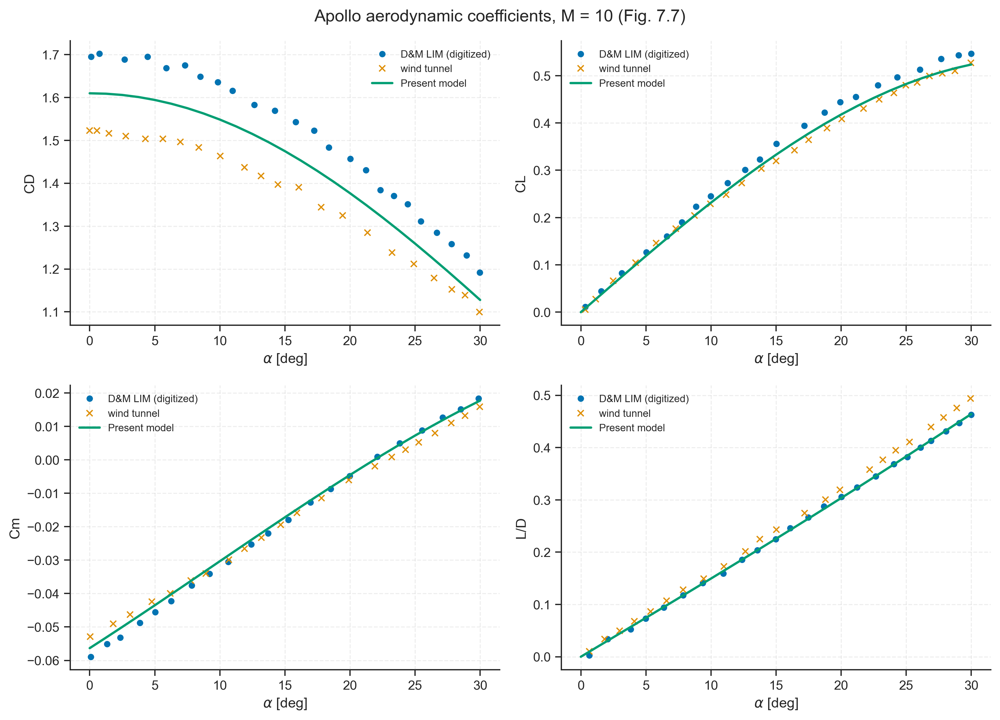
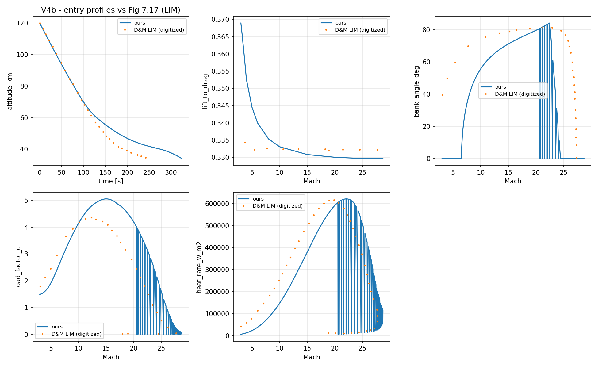

<div align="center">

# 🛰️ capsule_opt

**Robust shape optimization of a hypersonic re-entry capsule — from physics to uncertainty**

A Local-Inclination-Method aerothermal model, a 3-DoF entry trajectory, NSGA-II shape
optimization, and an uncertainty-quantification layer on top — validated rung by rung
against Dirkx & Mooij, *Aerothermodynamic Design and Assessment of Space Vehicles* (2017).


*From a defended MSc thesis → journal manuscript in preparation.*

</div>

---

## ✨ Highlights

- **Physics-first** — modified-Newtonian nose, exact Taylor–Maccoll tangent-cone afterbody,
  Prandtl–Meyer lee, Mach-blended databases, Sutton–Graves + Chapman heating, US76 atmosphere,
  rate-limited no-skip bank guidance on a rotating Earth.
- **Validated, not asserted** — 20+ checks against PlotDigitizer-extracted book data on the
  exact Apollo entry case; the core aerodynamics check (V2) passes **9/9**.
- **Honest uncertainty** — a 2800-run design of experiments over 3 shape parameters × 4
  uncertain inputs, gated with out-of-fold surrogate accuracy targets *before* any
  optimization claims.
- **Robust by design** — deterministic vs robust optimization under entry-state and
  aero-model-form uncertainty (work in progress).

## 📍 Where it stands

| Phase | Scope | Status |
|:---|:---|:---:|
| **Thesis** | Apollo-class capsule shape optimization (defended Jul 2026) | ✅ |
| **Phase 1** | D&M-faithful model upgrade + V0–V4 validation suite | ✅ closed |
| **Phase 2** | UQ: DOE → GP mixture surrogate → **gate passed** | ✅ |
| **Step 6** | Deterministic vs robust optimization + comparison | 🔜 in progress |

## 📦 Layout

```
capsule_opt/        the simulation package
  aerodynamics/       LIM pressure laws (Newtonian · Taylor–Maccoll · Prandtl–Meyer)
  heating/            Sutton–Graves stagnation + Chapman shoulder heating
  atmosphere/         US76 + hypersonic extension
  trajectory/         3-DoF rotating-Earth entry, RK4, no-skip bank guidance
  trim/               trim angle-of-attack solver
  geometry/           axisymmetric capsule parameterization
  optimization/       objectives, constraints, metrics
  uncertainty/        frozen uncertainty distributions + sampler
validation/         Phase 1 — V0–V4 checks vs Dirkx & Mooij (2017)
uq/                 Phase 2 — DOE, surrogate build + accuracy gate
  data/               2800-run DOE + trajectory descriptors
  artifacts/          trained surrogates (gitignored, regenerable)
  diagnostics/        surrogate-development forensics
main.py             deterministic NSGA-II optimization entry point
data/cache/         Taylor–Maccoll cone-Cp lookup table
results/            figures
```

## ✅ Phase 1 — validation against the book

All checks run our implementation against the book's own published curves on the Apollo
entry case (V = 7.83 km/s, γ = −4°, m = 4532 kg).

| Check | Content | Verdict |
|:---|:---|:---|
| V0 | US76 + extension vs reference tables | **PASS** (anchors ~2e-5) |
| V1 | Local pressure laws vs book charts | **PASS** |
| **V2** | **Apollo CD/CL/Cm/L/D vs Fig 7.7 — the core check** | **9/9 PASS** (L/D ≤ 0.022) |
| V3 | Heating vs Zoby–Sullivan + experiment trends | **PASS** |
| V4a | Trim angle vs Fig 7.17a | **PASS** (max 0.25°) |
| V4b/c | Full Apollo entry: profiles + Table 7.1 | peak heat rate **0.7%**, track **−1.1%** |

<table><tr>
<td width="50%" align="center"><br><sub><b>V2 — Apollo aerodynamics at M = 10</b> vs digitized book curves (LIM + NAA wind tunnel)</sub></td>
<td width="50%" align="center"><br><sub><b>V4b — full entry profiles</b> vs digitized Fig 7.17 panels</sub></td>
</tr></table>

Residual trajectory-level gaps are **attributed with evidence to the book's internally
inconsistent guidance spec, not to our physics** — the full forensic chain lives in
[`validation/RESULTS.md`](validation/RESULTS.md) and
[`validation/DEVIATIONS.md`](validation/DEVIATIONS.md).

## 📊 Phase 2 — uncertainty & surrogate

**Uncertainty model** (sized from Phase 1 validation residuals — evidence-based epistemic
uncertainty): γ₀ ~ N(−2°, 0.5°) · V₀ ~ N(7830, 50) m/s · k_CD, k_CL ~ N(1, 0.05).

**Surrogate** — Gaussian-process mixture over 3 shape + 4 uncertain dimensions, with
capture and trajectory-family classifiers (fast vs slow entry) in front.

5-fold out-of-fold accuracy gate, n = 2800:

| Output | R² | nRMSE | Verdict |
|:---|:---:|:---:|:---|
| Peak stagnation heat rate q̇_stag | 0.969 | 2.3% | ✅ PASS |
| Peak load factor n_max | 0.961 | 2.2% | ✅ PASS |
| Integrated heat load Qs | 0.983 | 2.3% | ➖ at threshold |
| Peak shoulder heat rate q̇_shldr | 0.952 | 3.0% | ➖ at threshold |
| Ground track s_g (fast family) | 0.932 | 3.8% | ✅ PASS |
| Ground track s_g (slow family) | — | — | ⚠️ irreducible |
| Family / capture classifiers | AUC 0.999 / 0.995 | — | ✅ |

> **Notable finding** — the slow-family ground track is *not noise*: perturbation probes
> show a locally linear but ~40× steeper response (ds_g/dγ₀ ≈ −2·10⁵ km/deg vs +5·10³ for
> fast entries). Lofted entries are legitimately dispersion-dominated, so s_g is treated
> with an explicit dispersion term rather than one average GP — a motivating result for
> robust optimization itself.

## 🚀 Running

Requires Python ≥ 3.10: `pip install -r requirements.txt`

```bash
# Phase 1 — validation suite (each module self-contained)
python -m validation.build_reference_data                        # rebuild reference CSVs
python -m validation.aerodynamics.validate_apollo_coefficients   # V2 (core check)
python -m validation.system.validate_apollo_end_to_end           # V4c

# Deterministic shape optimization
python main.py

# Phase 2 — surrogate pipeline (DOE → descriptors → build + gate)
python -m uq.doe 500
python -m uq.doe_descriptors
python -m uq.build_surrogate
```

Reference data were digitized (PlotDigitizer) from Dirkx & Mooij (2017); raw extractions
live outside the repo alongside the source book.

## 📚 References

- M. A. Dirkx, E. Mooij — *Aerothermodynamic Design and Assessment of Space Vehicles*,
  Springer, 2017. (validation source; book-page refs throughout `validation/`)
- Hirschel & Weiland — *Selected Aerothermodynamic Design Problems of Hypersonic Flight
  Vehicles*, 2009. (Apollo geometry)
- Plan & gate details: [`uq/PLAN.md`](uq/PLAN.md)
